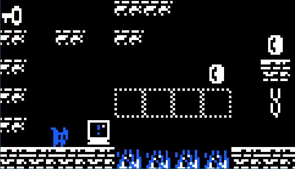

# Dunjo

**Dunjo** is a 2D dungeon platformer game built using [SFML (Simple and Fast Multimedia Library)](https://www.sfml-dev.org/). It features pixel art sprites designed by [Arks](https://arks.itch.io/dungeon-platform-tileset).


---

## Prerequisites

Before building **Dunjo**, ensure your environment has:

- A **C++ compiler** supporting C++17 or later.
- **CMake** (version 3.10 or higher).
- **SFML** (version 3.0 or higher).  

To install SFML, refer to the [official SFML installation guide](https://www.sfml-dev.org/tutorials/2.5/).

---

## Build Instructions

Follow these steps to build and run the game:

### Step 1: Clone the Repository

```
git clone https://github.com/ricardo-alberti/Dunjo
cd Dunjo
```
### Step 2: Create and Navigate to the Build Directory
```
mkdir out
cd out
```
### Step 3: Configure the Build with CMake
```
cmake ..
```
### Step 4: Compile the Game
```
make
```
### Step 5: Run the Game
```
./Dunjo
```

## Contributing

Contributions are welcome! 🎉 If you'd like to contribute:

    Fork this repository.
    Create a feature or bug-fix branch.
    Commit your changes and push to your branch.
    Open a pull request for review.
    For issues or suggestions, submit a report via the Issues page.

## License

This project is licensed under the MIT License.
Note: Sprite assets by Arks are subject to their respective licensing terms, which can be found on Arks' page.
